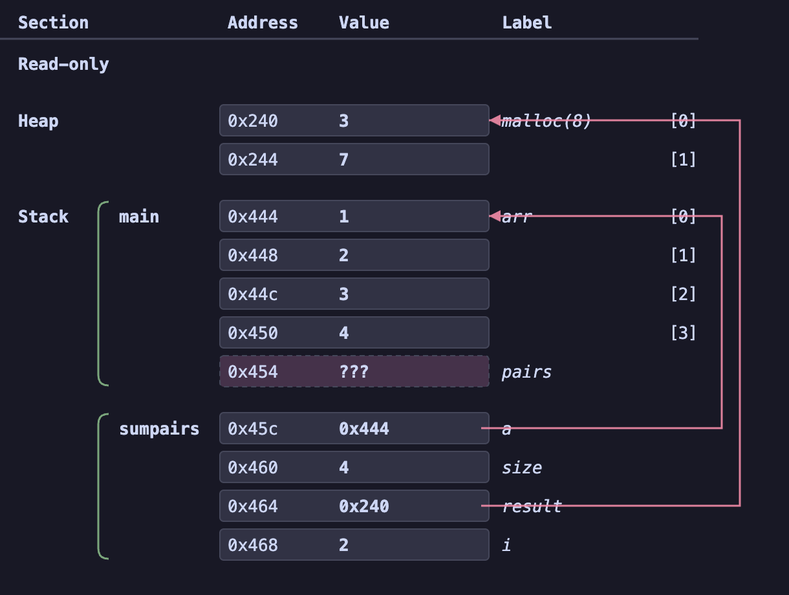
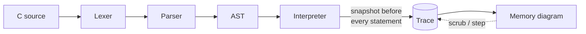

<div align="center">

# CMemoryViz

**A browser-based visualizer for C memory models — write C, watch the stack, heap, and pointers come to life.**

Built for students learning C systems programming (in the style of the University of Toronto's CSC 209 memory diagrams): type code on the left, and a precise `Section / Address / Value / Label` memory diagram builds up on the right as you step through execution — one statement at a time.

[](https://c-memory-viz.vercel.app)
[](https://github.com/YheChen/CMemoryViz/actions/workflows/ci.yml)
[](https://codecov.io/gh/YheChen/CMemoryViz)
[](https://prettier.io/)
[](https://www.typescriptlang.org/)
[](https://react.dev/)
[](https://vite.dev/)
[](LICENSE)

### [**▶ Try it live →**](https://c-memory-viz.vercel.app)



</div>

---

## Overview

Exam questions in a systems course often read: _"Fill in the memory diagram showing the state **exactly before the return on line 8**."_ Reasoning about that state by hand — every address, every stack frame, which pointer points where — is the hard part of learning C.

CMemoryViz makes it interactive. It runs entirely in your browser (there is **no server and no real compiler**): a hand-written C interpreter executes a teaching subset of the language and models memory the way the course does — explicit hex addresses, separate Read-only / Globals / Heap / Stack regions, labeled stack frames, literal pointer values drawn as arrows, and `???` for uninitialized memory.

Because the interpreter records a snapshot **before every statement**, you can scrub the whole execution timeline and land on any point — making "the state before line 8" a single click.

> Inspired by [MemoryViz](https://github.com/david-yz-liu/memory-viz) (which visualizes Python), rebuilt from scratch around C's fundamentally different, address-based memory model.

## Features

|                                   |                                                                                                                                                                                                                              |
| --------------------------------- | ---------------------------------------------------------------------------------------------------------------------------------------------------------------------------------------------------------------------------- |
| 🧠 **Real interpretation**        | Type arbitrary C and watch memory update — not canned animations. Functions, recursion, pointers, arrays, structs, strings, and dynamic memory all work.                                                                     |
| ⏯️ **Step & scrub**               | Play through execution statement by statement, or drag the timeline to any point. The current line is highlighted in the editor.                                                                                             |
| 🎯 **Breakpoints**                | Click the gutter to set a breakpoint; **Run** stops at the first hit and **Continue** jumps to the next — ideal for "state exactly before line N".                                                                           |
| 🔦 **Step-diff highlighting**     | Cells created or changed by the statement that just ran are tinted, so each step's effect on memory is obvious at a glance.                                                                                                  |
| 🧩 **Pointer arrows**             | Every pointer is drawn to the cell it references, with automatic channel routing to minimize crossings. Dangling pointers are flagged.                                                                                       |
| 🧪 **Heap report**                | Live allocation tracking: total `malloc`/`free`, bytes live at the current step, and a list of **leaks** (blocks never freed) with the line each was allocated on.                                                           |
| 📝 **Exam mode**                  | Blank out the Value/Label columns and hide the arrows, then fill in the diagram yourself and **Check** it — lenient grading (hex case, `NULL`, `???`, chars) with per-cell and per-arrow feedback, or **Reveal** the answer. |
| 📚 **Challenge bank**             | Curated, exam-style problems that open directly in exam mode paused at the target line.                                                                                                                                      |
| 🔗 **Shareable links**            | One click copies a URL that reproduces the exact code, step, and breakpoints — send a classmate "the state before line 8."                                                                                                   |
| ⬇️ **Export**                     | Save any diagram as SVG or PNG for problem sets and study notes.                                                                                                                                                             |
| 🩺 **Teaching-grade diagnostics** | Use-after-free names the freed block; double free, invalid free, and uninitialized reads report the offending address and line.                                                                                              |

## How it works

The pipeline is a classic tree-walking interpreter, with one twist: it snapshots memory before every statement so the UI can time-travel through the run.



The **memory model** uses a deterministic "clean" address allocator so diagrams are reproducible and readable, matching the conventions used in course handouts:

- `int` / pointer / `float` are 4 bytes (4-byte aligned); `double` is 8 bytes (8-byte aligned); `char` is 1 byte.
- Fixed section bases — Read-only `0x104`, Globals `0x1a0`, Heap `0x240`, Stack `0x444` — and functions get pseudo-addresses from `0x50` so function pointers carry real values.
- Each function call pushes a labeled frame at a higher address; uninitialized cells render as `???`; globals are zero-initialized, as in real C.

## Supported C subset

<details>
<summary><strong>Click to expand the full language coverage</strong></summary>

- **Functions** — calls, recursion, `return`, and **function pointers** (`int (*fp)(int, int)`, `fp = add`, `(*fp)(...)`, function-pointer parameters)
- **Types** — `int`, `char`, `void`, `float`, `double`, pointers, arrays (including `int a[] = {...}` and **multidimensional** `int m[2][2] = {{...},{...}}`), and `struct` (including `{...}` initializers)
- **Global variables** — their own diagram section, zero-initialized
- **Strings** — `char s[] = "hi"` (bytes on the stack) and `char *s = "hi"` (read-only section), rendered byte-by-byte including `'\0'`
- **Dynamic memory** — `malloc` / `calloc` / `realloc` / `free`, `sizeof`, casts, and `int **` 2D dynamic arrays
- **Operators** — arithmetic (float-aware), comparison, logical, bitwise, and pointer arithmetic; `&`, `*`, `[]`, `.`, `->`, pre/post `++`/`--`
- **Control flow** — `if` / `else`, `while`, `for`, `break`, `continue`
- **I/O** — `printf` with `%d %i %u %c %s %f %g %p %x %%`, captured to an on-screen stdout; `strlen`

</details>

## Getting started

**Prerequisites:** [Node.js](https://nodejs.org/) 18+ and npm.

```bash
# Clone and install
git clone https://github.com/YheChen/CMemoryViz.git
cd CMemoryViz
npm install

# Start the dev server (http://localhost:5173)
npm run dev

# Run the test suite
npm test

# Lint and format
npm run lint
npm run format        # or: npm run format:check

# Build for production (type-checks, then bundles to dist/)
npm run build
```

## Project structure

```
src/
├─ interpreter/          # The engine — pure TypeScript, no DOM
│  ├─ lexer.ts           #   C tokenizer
│  ├─ parser.ts          #   recursive-descent parser → AST
│  ├─ ast.ts             #   AST node & C type definitions
│  ├─ memory.ts          #   sections, address allocator, typed cell store
│  └─ interpreter.ts     #   evaluator; snapshots memory before each statement
├─ components/
│  ├─ CodeEditor.tsx     #   Monaco editor, breakpoints, error squiggles
│  ├─ MemoryDiagram.tsx  #   SVG diagram renderer + pointer arrows + export
│  ├─ ExamDiagram.tsx    #   fill-in-the-blank grading mode
│  ├─ HeapReportPanel.tsx#   leak / allocation report
│  ├─ ChallengePicker.tsx#   practice-problem menu
│  └─ Controls.tsx       #   run / step / scrub the trace
├─ challenges.ts         # curated exam-style problems
├─ share.ts              # URL-hash state encoding for shareable links
└─ App.tsx               # composition root
```

The interpreter has **zero UI dependencies** — it's plain TypeScript that turns a source string into a trace of memory snapshots, which keeps it fully unit-testable and keeps rendering concerns out of the language semantics.

## Testing

The interpreter and supporting logic are covered by [Vitest](https://vitest.dev/) — **70+ tests** across lexing/parsing/evaluation, the heap lifecycle report, `realloc`/`int **` semantics, share-link round-tripping, diagram diffing, and every bundled challenge. The suite includes a test that reproduces the canonical `sumpairs` midterm diagram address-for-address.

**Differential testing against a real C compiler.** Because the interpreter is a pure `string → trace` function, a corpus of C programs (`test/corpus/`) is compiled and run with an actual C compiler and the interpreter's `stdout` is asserted to match — ground-truth validation that runs on every CI build (GitHub's runners have `gcc`). Locally it skips gracefully if no compiler is installed.

```bash
npm test
```

## Deployment

The app is a fully static Vite build with no backend, deployed on [Vercel](https://vercel.com/) with automatic production deploys on every push to `master`. Because `npm run build` runs `tsc` first, type errors block bad deploys.

## Roadmap

- [ ] Hover a variable to highlight its cells (and vice-versa)
- [ ] More of the C standard library: `strcpy`, `strcat`, `memcpy`
- [ ] Structs passed/returned by value, `union`, `typedef`
- [ ] Beyond the memory model: `fork()` / process view, file-descriptor tables

## Contributing

Contributions are welcome — see [CONTRIBUTING.md](CONTRIBUTING.md) for setup and
the check suite. In short: `npm run lint`, `npm run format:check`, `npx tsc
--noEmit`, `npm test`, and `npm run build` should all pass (CI enforces them).

## Acknowledgements

- [MemoryViz](https://github.com/david-yz-liu/memory-viz) for pioneering this style of teaching visualization for Python.
- The University of Toronto CSC 209 course, whose memory-diagram conventions this tool mirrors.

## License

Released under the [MIT License](LICENSE).
